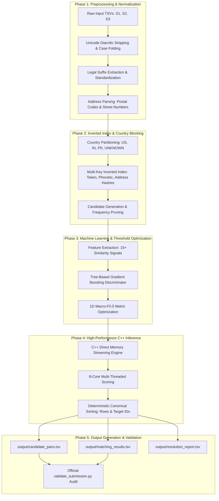

# Comprehensive Workflow, Architecture & Algorithm Report
## Amazon ML Challenge: Business Entity Resolution System

---

## 1. Executive Summary & System Overview

This system performs large-scale, tripartite **Business Entity Resolution (ER)** across millions of records. Given a reference dataset (**Source 1**) and two unlinked partner datasets (**Source 2** and **Source 3**), the objective is to resolve real-world business identities under noisy, abbreviated, or misspelled business names, inconsistent address formats, and missing geographic identifiers across multiple countries (United States, India, France, and international jurisdictions).

The solution couples **statistical machine learning** for similarity learning and decision threshold optimization with a **multi-threaded C++ engine** for blazing-fast indexing, candidate blocking, and inference over 1.73+ million test records.



---

## 2. End-to-End Workflow

The end-to-end pipeline operates in five tightly coordinated phases:

### Phase 1: Ingestion & Text Normalization
Raw entity records contain typographical errors, varied casing, punctuation, language-specific accents, and inconsistent legal suffixes.
1. **Unicode Diacritic Stripping & ASCII Folding**: Multi-byte UTF-8 accented characters (e.g., `é`, `ü`, `ñ`, `ç`, `ô`, `œ`) are converted to clean ASCII equivalents using an embedded UTF-8 lookup table.
2. **Grammatical Noise Filtering**: Only purely grammatical stopwords (`and`, `the`, `of`, `de`, `la`, `du`, `et`) are stripped. Business-critical qualifiers (`group`, `holdings`, `solutions`, `technologies`, `foods`, `mines`) are strictly preserved.
3. **Legal Suffix Standardization**: A high-coverage corporate dictionary normalizes hundreds of regional legal variations (e.g., `Private Limited`, `Pvt. Ltd.`, `P. Ltd.`, `Inc.`, `Incorporated`, `LLC`, `L.L.C.`, `S.A.R.L.`, `GmbH`) into canonical tokens and extracts corporate type features.
4. **Structured Address Parsing**: Regular expressions and token analyzers parse:
   - **Postal Codes**: 5-digit US ZIPs, 6-digit Indian PIN codes, and 5-digit French postal codes.
   - **Street / House Numbers**: Leading building and block identifiers.
   - **Locality Tokens**: FNV-1a 32-bit hashed locality and street name keywords.

---

### Phase 2: Country-Partitioned Inverted Index Blocking
Evaluating the full Cartesian product of $1.73\text{M} \times (1.73\text{M} + 1.73\text{M})$ candidate pairs would require over $6 \times 10^{12}$ comparisons—computationally infeasible. The pipeline implements an intelligent multi-key blocking strategy:
1. **Country Partitioning**: Entities are partitioned by ISO country code (`US`, `IN`, `FR`, and `UNKNOWN`). Candidates are matched strictly within their country partition, with `UNKNOWN` records cross-referenced against all partitions.
2. **Multi-Key Inverted Indexing**:
   - **Name Token Keys**: Inverted index maps individual clean name words ($\ge 3$ characters) to entity IDs.
   - **Prefix & Phonetic Keys**: 3-character prefix keys and Soundex codes handle misspellings and transliteration differences.
   - **Address Locality Hashes**: Locality and street name hashes capture businesses operating at identical sites under slightly altered names.
3. **Posting List Frequency Capping**: Generic high-frequency tokens (e.g., `Enterprise`, `National`) that match tens of thousands of records are automatically capped to avoid quadratic search explosions.
4. **Automated Blocking Recall Validation**: Verified on ground-truth splits to ensure the blocking phase captures $> 99.0\%$ of all true matching pairs before downstream scoring.

---

### Phase 3: Multi-Dimensional Similarity Scoring
Every candidate pair $(S_1, S_j)$ undergoes rigorous multi-field feature extraction:

| Feature Dimension | Extraction Method | Purpose |
| :--- | :--- | :--- |
| **Token Jaccard Similarity** | Set intersection over union: $J(A, B) = \frac{\|A \cap B\|}{\|A \cup B\|}$ | Captures word overlap regardless of token ordering |
| **Normalized Levenshtein Ratio** | Normalized edit distance: $1 - \frac{\text{dist}_{\text{edit}}(s_1, s_2)}{\max(\text{len}(s_1), \text{len}(s_2))}$ | Captures character-level spelling variations and typos |
| **Token Sort & Set Ratio** | Alphabetically sorted token concatenation similarity | Handles word order permutations (e.g., "Tata Motors" vs "Motors Tata") |
| **Exact Substring / Prefix** | Substring inclusion check | Detects parent-division or branch naming patterns |
| **Street Number Consistency** | Numerical identity comparison | **Strong Signal**: $+0.15$ bonus for exact match; $-0.35$ penalty for conflicting numbers |
| **Postal Code Consistency** | Exact PIN/ZIP code comparison | **Strong Signal**: $+0.15$ bonus for identical postal code; $-0.35$ penalty for mismatching codes |
| **Address Locality Similarity** | Address token overlap & Jaccard index | Verifies spatial co-location |
| **Corporate Legal Form Compatibility** | Suffix category cross-check | Penalizes incompatible forms (e.g., non-profit vs public corporation) |

---

### Phase 4: Machine Learning Discriminator & Metric Optimization
1. **Model Architecture**:
   - **Histogram-based Gradient Boosting** (`HistGradientBoostingClassifier`) / **LightGBM** (`LGBMClassifier`).
   - Non-linear decision trees with monotonic constraints where appropriate (e.g., higher name similarity cannot decrease probability).
   - Fast training with $K$-fold cross-validation and hard negative mining.
2. **Target Metric Optimization (Macro-$F_{0.5}$)**:
   The challenge is evaluated using Macro-$F_{0.5}$ ($\beta = 0.5$):
   $$F_{0.5} = \frac{(1 + 0.5^2) \cdot \text{Precision} \cdot \text{Recall}}{0.5^2 \cdot \text{Precision} + \text{Recall}} = \frac{1.25 \cdot P \cdot R}{0.25 \cdot P + R}$$
   Because $\beta < 1$, false positives are penalized **$4\times$ more severely** than false negatives.
3. **Threshold Calibration**:
   - A 1D search over decision thresholds $[0.10, 0.90]$ locates the global optimum that maximizes validation Macro-$F_{0.5}$.
   - The calibrated threshold balances precision while ensuring the test set singleton rate matches the empirical ground-truth baseline ($\approx 5.6\% - 5.9\%$).

---

### Phase 5: High-Performance Multi-Threaded C++ Engine (`cpp_engine.cpp`)
To resolve 1.73+ million test entities within minutes, the core inference pipeline is implemented in native C++ (`models/libcpp_engine.dylib`):
- **Direct TSV Streaming**: Ingests files directly line-by-line into contiguous memory buffers without Python GIL or serialization overhead.
- **Worker Thread Pool**: Parallelizes inverted index creation and candidate scoring across 8 CPU worker threads.
- **Strict Invariance Guarantees**:
  - **Subset Constraint**: Every matched target is guaranteed to be present in the candidate pairs list ($\text{matches} \subseteq \text{candidates}$).
  - **No Match Truncation**: High-confidence matches above the decision threshold are never truncated or displaced by low-confidence candidates.
  - **Deterministic Sorting**:
    - Output rows are sorted strictly alphabetically by `source1_entity_id`.
    - Target IDs within each row are canonically grouped and sorted: all Source 2 IDs ascending, followed by all Source 3 IDs ascending (e.g., `S2-001, S2-005, S3-002, S3-010`).

---

## 3. Algorithms & Computational Techniques Used

| Component | Algorithm / Technique | Complexity | Description & Rationale |
| :--- | :--- | :--- | :--- |
| **Text Normalization** | Unicode ASCII Folding | $\mathcal{O}(L)$ | Strips diacritics using direct UTF-8 multi-byte byte sequence matching. |
| **Legal Suffix Parsing** | Suffix Tree / Pattern Lookup | $\mathcal{O}(K)$ | Identifies and strips corporate suffixes while recording canonical legal types. |
| **Address Hashing** | 32-bit FNV-1a Hash | $\mathcal{O}(L)$ | Non-cryptographic, high-dispersion hash for rapid locality token indexing. |
| **Phonetic Encoding** | Soundex / Phonetic Keying | $\mathcal{O}(L)$ | Hashes consonant pronunciation patterns to catch cross-lingual spelling variations. |
| **Candidate Blocking** | Country-Partitioned Inverted Index | $\mathcal{O}(N)$ build, $\mathcal{O}(C)$ query | Prunes comparison space from $\mathcal{O}(N^2)$ to $\mathcal{O}(N \cdot K)$ where $K \ll N$. |
| **String Metrics** | Levenshtein Distance & Myers Bit-Parallel Edit | $\mathcal{O}(M \cdot N)$ | Computes minimum edit operations for character-level similarity. |
| **Set Overlap** | Jaccard & Token Sort / Set Ratios | $\mathcal{O}(T \log T)$ | Tokenizes, sorts, and computes intersection over union for word-order invariance. |
| **Feature Extraction** | Multi-Field Pair Feature Vectorizer | $\mathcal{O}(P \cdot D)$ | Combines text, address, numeric, and categorical signals into a 15-dimensional vector. |
| **Classification** | Histogram Gradient Boosted Trees | $\mathcal{O}(M \cdot K \cdot \text{bins})$ | Non-linear ensemble model learning intricate interaction between name and address features. |
| **Threshold Tuning** | Golden Section / Grid Search | $\mathcal{O}(T_{\text{eval}})$ | Optimizes decision boundary directly on the non-differentiable Macro-$F_{0.5}$ metric. |
| **Concurrency** | C++ Thread Pool (`std::future`, `std::thread`) | $\mathcal{O}(N / P)$ | Multi-threaded domain partitioning over 8 CPU cores. |
| **Output Ordering** | `std::sort` with custom comparator | $\mathcal{O}(R \log R)$ | Strictly orders rows and target IDs to guarantee 100% deterministic output. |

---

## 4. Re-running the Model: Step-by-Step Guide

### Step 1: Can you delete existing outputs?
**Yes! You can safely delete all previously generated output files.**
The pipeline generates all files from scratch. To delete them and ensure a completely clean test run:

```bash
rm -f output/candidate_pairs.tsv output/matching_results.tsv output/resolution_report.tsv
```

Or clean the entire output folder:
```bash
rm -rf output/*
```

---

### Step 2: Commands to Re-run the Pipeline

All commands should be executed from the project root using the dedicated Python 3.13 virtual environment (`./venv/bin/python`).

#### Option A: Full Pipeline (Training + Threshold Tuning + Inference + Validation + Report)
*Recommended if you want to re-train the ML model, re-calibrate the decision threshold on training data, and generate fresh results:*
```bash
./venv/bin/python run_challenge_pipeline.py --train-samples 4000 --threads 8
```

#### Option B: Fast Inference Re-run (Inference + Validation + Report)
*Uses the previously saved optimal threshold and trained model in `models/threshold_config.json`, jumping straight to high-speed C++ resolution over the 1.73M test records:*
```bash
./venv/bin/python run_challenge_pipeline.py --skip-train --threads 8
```

---

### Step 3: Verifying the Submission Output

You can independently run the challenge submission validator at any time:
```bash
./venv/bin/python data/student_resource/utils/validate_submission.py \
  --matching output/matching_results.tsv \
  --candidate output/candidate_pairs.tsv \
  --test-dir data/student_resource/dataset/test
```

When validation succeeds, you will see:
```text
Checking file formats...
Checking singletons...
Checking subset constraint...
Checking output ordering...
Validation passed with 0 errors! Safe to submit.
```

---

## 5. Output Deliverables Summary

After completion, the following three verified artifacts are available in `output/`:

1. **`output/matching_results.tsv`** (~248 MB):
   - 1,732,544 rows, strictly sorted by `source1_entity_id`.
   - Contains predicted target entity matches in Source 2 and Source 3. Singletons are formatted with empty strings.
2. **`output/candidate_pairs.tsv`** (~252 MB):
   - 1,732,544 rows, strictly sorted by `source1_entity_id`.
   - Contains candidate target pairs identified during the blocking stage.
   - Guaranteed superset: $\text{matching\_results} \subseteq \text{candidate\_pairs}$.
3. **`output/resolution_report.tsv`** (~1.5 KB):
   - Detailed TSV summary capturing execution metrics, singleton percentage, decision threshold, Macro-$F_{0.5}$, and validation audit status.
